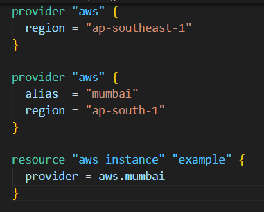
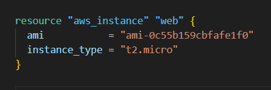
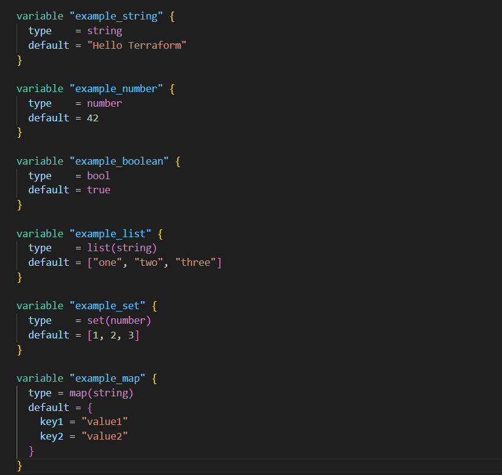
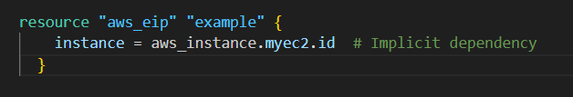
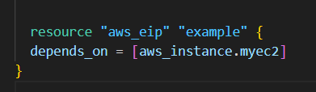

# ✅ Terraform Associate Exam Preparation – Bullet Points (Part 1)

---

## 📌 1. Understanding Providers & Initialization

- **Providers** define how Terraform interacts with services (e.g., AWS, Azure).
- After defining a provider, `terraform init` is **required** to initialize the directory and download plugins.
- Provider plugins are stored under `.terraform/providers/registry.terraform.io/hashicorp/aws`.

---

## ❓ 2. Is the Provider Block Mandatory?

- The **provider block is optional** if it’s empty (no region/credentials).
- Terraform can infer providers using the `required_providers` block.
- However, defining **a provider is necessary** for resource creation.

---

## 🧩 3. Using Provider Aliases

- **Aliases** let you use multiple configurations of the same provider (e.g., for multi-region setups).

### 🔽 Example:



## 🔐 4. Best Practices for Credentials

Avoid hardcoding credentials in the provider block.

Use one of the following secure methods:
- **Environment variables**
- **Shared credentials file**
- **IAM roles / external authentication mechanisms**

---

## ⚙️ 5. Terraform Settings Block (`terraform` block)

Includes:
- `required_version`: Specifies Terraform version (e.g., `>= 1.2.0`)
- `required_providers`: Defines provider dependencies and versions
- `backend`: Used for remote state (covered later)

---

## 🛠️ 6. Key Terraform Commands

- `terraform init` → Initialize working directory  
- `terraform init -upgrade` → Upgrade provider versions  
- `terraform plan` → Preview changes without modifying infrastructure  
- `terraform apply` → Apply changes to infrastructure  
- `terraform destroy` → Tear down infrastructure  
- `terraform fmt` → Format configuration files  
  - `-check` → Validate formatting only  
  - `-recursive` → Format files in subdirectories  

---

## 🔢 7. Version Constraints & Provider Tiers

### Version Operators:
- `>=`, `<=`, `~>`

### Provider Categories:
- ✅ **Official** – Maintained by HashiCorp  
- 🤝 **Partner** – Verified by trusted third parties  
- 🧪 **Community** – Open source or custom providers  

---

## 📂 8. State File & Terraform Behavior

- Default state file: `terraform.tfstate`  
- `terraform plan` → Does **not** change the state file  
- Infrastructure can be destroyed via:
  - `terraform destroy`
  - Deleting a resource from `.tf` files and running `terraform apply`

---

# ✅ Terraform Associate Exam Preparation – Bullet Points (Part 2)

---

## 1. Terraform Validate (`terraform validate`)

- Validates Terraform configuration files in the current directory.
- Requires an initialized directory (`terraform init` must be run first).
- `terraform plan` implicitly performs validation, so `terraform validate` is not always necessary.

---

## 2. Terraform Refresh (`terraform refresh`)

- Reads current settings of managed resources and updates the state file accordingly.
- Deprecated due to unsafe behavior; replaced by `terraform apply -refresh-only`.

---

## 3. Resource Block Structure


- **Resource Type:** e.g., `aws_instance`
- **Local Name:** e.g., `web`
- **Arguments:** e.g., `ami`, `instance_type`
- **Example Resource Address:** `aws_instance.web`
- Resource names must be unique within a module.

---

## 4. Terraform Data Types

- Supported types: `string`, `number`, `boolean`, `list`, `set`, `map`, `null`.
- Terraform does **not** support arrays.

---

## 5. Terraform State Management

Important state subcommands:
- `terraform state move` → Moves resources within or across state files.
- `terraform state remove` → Removes a resource from the state without deleting it in the cloud.

---

## 6. Debugging Terraform

Enable logs using environment variables:
- `TF_LOG` (levels: `TRACE`, `DEBUG`, `INFO`, `WARN`, `ERROR`)
- `TF_LOG_PATH` (save logs to a file)

---

## 7. Terraform Import (`terraform import`)

- Imports existing infrastructure into Terraform management.
- New feature: Automatic code generation for imported resources.
- Supports multiple resource imports using `import` blocks.

---

## 8. Local Values (`locals`)

- Used to avoid repeating expressions.
- Defined inside a `locals` block, referenced using `local.` (singular).

---

## 9. Terraform Workspaces

- Manage multiple deployments using the same configuration.
- State files stored in `terraform.tfstate.d` directory.
- Not suitable for strong isolation (e.g., production vs. staging).
- Common workspace commands:
  - `terraform workspace new <name>`
  - `terraform workspace select <name>`
  - `terraform workspace list`

---

## 10. Terraform Modules

- Encapsulate reusable infrastructure code.
- Module locations:
  - Local filesystem (`./modules/example`)
  - Git repositories (`git::https://github.com/example.git`)
  - Terraform Registry (`terraform-aws-modules/vpc/aws`)
- Root Module vs. Child Module:
  - Root module is the main entry point.
  - Child module is any module called by another module.
- Module outputs expose values to other modules.
- Versioning:
  - Not mandatory but recommended (e.g., `version = "~> 1.2"`).

---

## 11. Terraform Registry

- Hosts publicly available Terraform modules.
- Module address format: `[hostname]/[namespace]/[name]/[system]`
- Default registry: `registry.terraform.io`

---

## 12. Terraform Functions

Terraform does **not** support user-defined functions.

Important built-in functions:
- `lookup()` → Retrieves values from a map.
- `zipmap()` → Converts lists into a map.
- `index()` → Returns index of an element in a list.
- `element()` → Retrieves element at a specific index.
- `toset()` → Converts a list into a set.
- `timestamp()` → Retrieves the current timestamp.
- `file()` → Reads content from a file.

---

## 13. Meta-Arguments in Terraform

Meta-arguments customize resource behavior.

Common meta-arguments:
- `depends_on` → Specifies dependencies between resources.
- `count` → Creates multiple instances of a resource.
- `for_each` → Iterates over a map or set.
- `lifecycle` block with options:
  - `ignore_changes` → Ignores changes to specified attributes.
  - `prevent_destroy` → Prevents accidental deletion.
  - `create_before_destroy` → Creates new resources before destroying old ones.

---

# ✅ Terraform Associate Exam Preparation – Bullet Points (Part 3)

---

## 1. Sentinel Policy as Code

- Framework used to enforce security and compliance rules.
- Runs after `terraform plan` but before `terraform apply`.
- Use cases:
  - Enforcing tagging policies for EC2 instances.
  - Checking if an S3 bucket is encrypted.

---

## 2. Terraform Graph (`terraform graph`)

- Visual representation of resource dependencies.
- Generates output in DOT format, which can be converted into an image.

---

## 3. Input Variables & tfvars Files

- `terraform.tfvars` allows multi-environment deployments (e.g., Dev, Prod).
- Select a specific variable file using:  
  `terraform plan -var-file="prod.tfvars"`
- Variable precedence (last one wins):
  1. Environment variables (with `TF_VAR_` prefix)
  2. `terraform.tfvars` or `.tfvars.json` files
  3. `auto.tfvars` or `.auto.tfvars.json` files
  4. Command-line variables (`-var` and `-var-file`)
- Reserved variable names that cannot be used:
  - `count`, `depends_on`, `for_each`, `lifecycle`, `providers`, `source`

---

## 4. Terraform State & Output Values

- State file (`terraform.tfstate`) does **not** store input variables.
- Output values **are** stored in the state file.
- Use `terraform output` to extract values from the state.

---

## 5. Terraform Console (`terraform console`)

- Used for testing Terraform expressions and functions interactively.

---

## 6. Dependency Lock File (`terraform.lock.hcl`)

- Locks provider versions to avoid unexpected upgrades.
- `terraform init -upgrade` updates the lock file.

---

## 7. Dependencies in Terraform

- **Implicit dependency**: Terraform automatically determines resource order.

  ```hcl
  resource "aws_eip" "example" {
    instance = aws_instance.myec2.id  # Implicit dependency
  }



- **Explicit dependency**: Manually define order using depends_on.



## 8. Terraform Data Sources

- Fetch and use data from external resources (e.g., existing AWS VPCs).

---

## 9. Terraform Enterprise & HCP Terraform

- Provide:
  - Single sign-on (SSO)
  - Audit logging
  - Team management & governance
  - Private Module Registry
  - Remote state storage with encryption
- Terraform Cloud (HCP) automatically runs plans when code is pushed to VCS.

---

## 10. Protecting Secrets in HCP Terraform

- Mark Terraform or environment variables as **Sensitive** to prevent visibility.
- Sensitive values cannot be viewed even by admins.

---

## 11. Recreating Resources in Terraform

- Force resource replacement using:  
  `terraform apply -replace="aws_instance.example"`
- `terraform taint` is deprecated; use `-replace` instead.

---

## 12. Infrastructure as Code (IaC) Benefits

- **Automation**
- **Versioning**
- **Reusability**

### Common IaC tools:
- Terraform (multi-cloud)
- AWS CloudFormation
- Azure Resource Manager
- Google Cloud Deployment Manager

---

## 13. Terraform Output Command (`terraform output`)

- Extracts values from output variables stored in the state file.

---

## 14. Terraform & Git

- By default, Terraform pulls from the default branch in Git.
- To specify a branch or commit:  
  `source = "git::https://github.com/example.git?ref=branch-name"`

---
