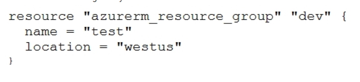

# ✅ Terraform Associate Exam Preparation – Bullet Points  
*Quick Reference Guide for Exam Topics (Part 1)*

---

## 📌 1. Understanding Providers & Initialization

- **Providers** define how Terraform interacts with services (e.g., AWS, Azure).
- After defining a provider, `terraform init` is **required** to initialize the directory and download plugins.
- Provider plugins are stored under `.terraform/providers/registry.terraform.io/hashicorp/aws`.

---

## ❓ 2. Is the Provider Block Mandatory?

- The **provider block is optional** if it’s empty (no region/credentials).
- Terraform can infer providers using the `required_providers` block.
- However, defining **a provider is necessary** for resource creation.

---

## 🧩 3. Using Provider Aliases

- **Aliases** let you use multiple configurations of the same provider (e.g., for multi-region setups).

### 🔽 Example:

